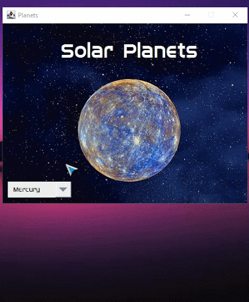

# Event Driven Programming - Planets

## Table of contents

- [Overview](#overview)
  - [Screenshot](#screenshot)
- [My process](#my-process)
  - [Built with](#built-with)
  - [What I learned](#what-i-learned)
- [Author](#author)
- [Acknowledgments](#acknowledgments)

## Overview

### Screenshot

#### Planets Preview
---

## My process

### Built with

- Java Swing

### What I learned

I learned to build GUI application that allows users to select a planet from a combo box and view information about the selected planet. It also uses custom styling and a custom cursor to enhance the user experience. The application appears to be educational, providing facts about different planets in our solar system when the "About" button is clicked for each planet.

## Author

- Website - [Shanice](https://github.com/sdacleofe/about-me)

## Acknowledgments

I want to express my gratitude to my event-driven programming course instructor for imparting knowledge about this java swing concept to us.

**This project was made on March 2, 2022**